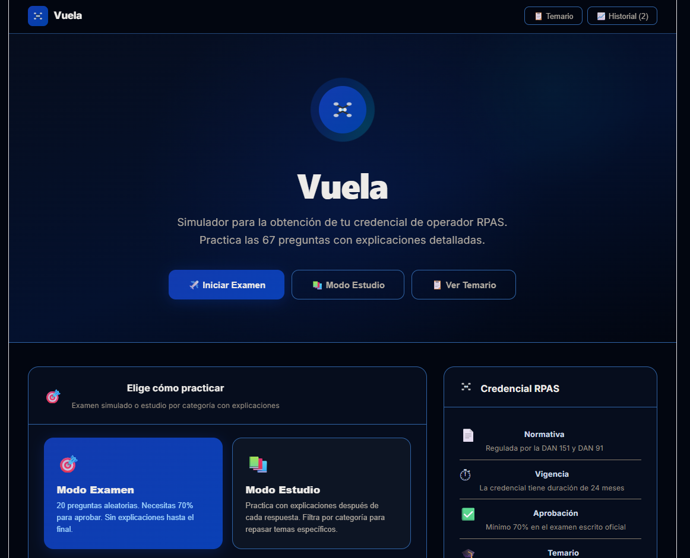
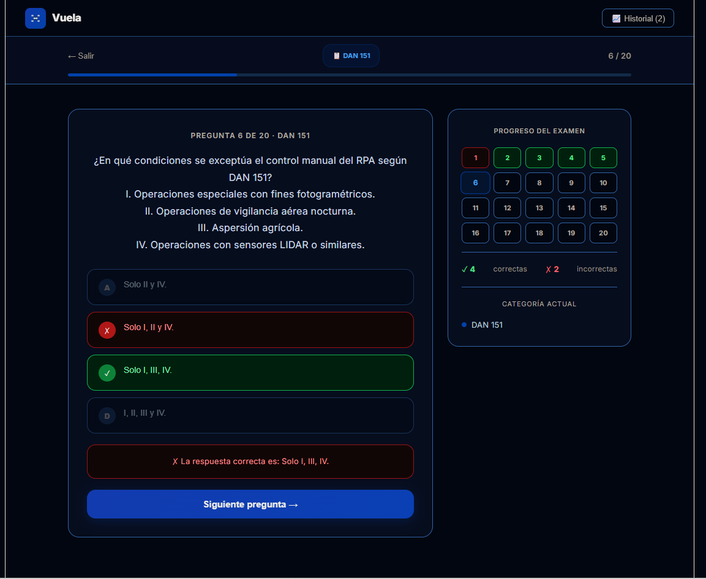
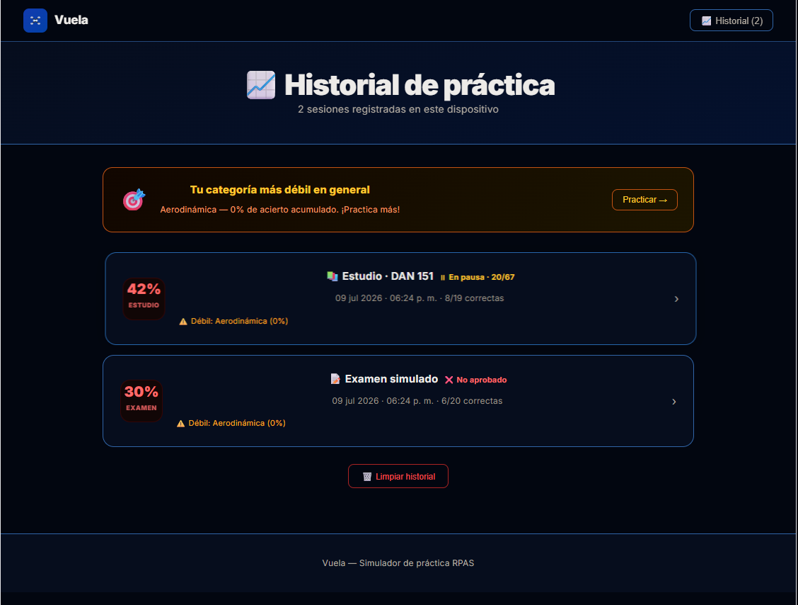

<h1 align="center">
  <br/>
  Vuela
</h1>

<p align="center">
  <a href="./LICENSE"></a>
  
  
  
</p>

<p align="center">
  <b><a href="#-español">🇪🇸 Español</a></b> &nbsp;|&nbsp; <b><a href="#-english">🇬🇧 English</a></b>
</p>

<p align="center">
  <a href="https://vuela-pied.vercel.app/"><b>Ver Demo en vivo / Live Demo</b></a>
</p>

---

## 🇪🇸 Español

Simulador de práctica para obtener la licencia de operador RPAS (drone) en Chile. Estudia y practica con preguntas reales basadas en la normativa DGAC (DAN 91, DAN 151, Código Aeronáutico, meteorología aeronáutica, y más).

> Este proyecto nació de mi propia experiencia sacando la licencia de operador de drones: no encontré una herramienta que simulara bien el formato real del examen, así que construí una.

###  Capturas de pantalla

| Inicio | Modo Examen | Historial |
|---|---|---|
|  |  |  |

###  Funcionalidades

- **Modo Examen**: examen simulado cronometrado con preguntas aleatorias, requiere 75% para aprobar, sin explicaciones hasta el final (igual que el examen real).
- **Modo Estudio**: practica por categoría con explicaciones inmediatas después de cada respuesta.
- **Guardado de progreso**: si dejas una sesión de estudio a la mitad, se guarda automáticamente y puedes retomarla justo donde la dejaste, o forzar el guardado con el botón "Guardar y Salir".
- **Historial persistente**: cada examen y sesión de estudio queda registrado (puntaje, categoría más débil, fecha), sincronizado en la nube vía Supabase.
- **Detección de categoría débil**: después de cada sesión, la app identifica tu categoría más débil y sugiere repasarla.
- **Temario integrado**: navega todas las preguntas y respuestas correctas en modo solo lectura, sin necesidad de rendir un examen.
- **67 preguntas oficiales** en 7 categorías: DAN 151, Meteorología, Aerodinámica, DAN 91, Código Aeronáutico, Reglamentos y Código Penal.

###  Stack tecnológico

| Capa | Tecnología |
|---|---|
| Frontend | React 19 + Vite |
| Empaquetado nativo | Capacitor (Android) |
| Backend | Supabase (auth anónima + Row Level Security) |

###  Instalación

```bash
git clone https://github.com/erikurt9/Vuela.git
cd Vuela
npm install
```

Copia `.env.example` a `.env` y completa tus credenciales de Supabase:

```bash
cp .env.example .env
```

```
VITE_SUPABASE_URL=https://tu-proyecto.supabase.co
VITE_SUPABASE_ANON_KEY=tu-clave-publica
```

#### Configuración de Supabase

1. Crea un proyecto en [supabase.com](https://supabase.com).
2. Habilita **Authentication → Sign In / Providers → Allow anonymous sign-ins**.
3. Ejecuta el script `supabase/migration.sql` en el SQL Editor de tu proyecto.

###  Desarrollo

```bash
npm run dev       # servidor de desarrollo
npm run build     # build de producción
npm run preview   # preview del build
```

#### Build de Android (Capacitor)

```bash
npm run build
npx cap sync android
npx cap open android
```

###  Licencia

Este proyecto está bajo licencia MIT — ver [LICENSE](./LICENSE). El contenido de las preguntas está basado en normativa pública de la DGAC Chile y se ofrece con fines educativos.

<p align="right"><a href="#vuela">⬆ Volver arriba</a></p>

---

## 🇬🇧 English

A practice simulator for obtaining an RPAS (drone) operator credential in Chile. Study and practice with real questions based on DGAC regulations (DAN 91, DAN 151, Aeronautical Code, aviation meteorology, and more).

> This project came out of my own experience getting my drone operator license: I couldn't find a tool that properly simulated the real exam format, so I built one.

###  Screenshots

| Home | Exam Mode | History |
|---|---|---|
|  |  |  |

###  Features

- **Exam Mode**: timed mock exam with randomized questions, requires 75% to pass, no explanations until the end (matching the real exam format).
- **Study Mode**: practice by category with immediate explanations after each answer.
- **Progress saving**: leave a study session halfway through and resume exactly where you left off — progress saves automatically, and can also be forced with the "Save & Exit" button.
- **Persistent history**: every exam and study session gets logged (score, weakest category, date), synced to the cloud via Supabase.
- **Weak category detection**: after each session, the app identifies your weakest category and suggests reviewing it.
- **Built-in syllabus**: browse all questions and correct answers in read-only mode, without taking an exam.
- **67 official questions** across 7 categories: DAN 151, Meteorology, Aerodynamics, DAN 91, Aeronautical Code, Regulations, and Criminal Code.

###  Tech stack

| Layer | Technology |
|---|---|
| Frontend | React 19 + Vite |
| Native packaging | Capacitor (Android) |
| Backend | Supabase (anonymous auth + Row Level Security) |

###  Installation

```bash
git clone https://github.com/erikurt9/Vuela.git
cd Vuela
npm install
```

Copy `.env.example` to `.env` and fill in your Supabase credentials:

```bash
cp .env.example .env
```

```
VITE_SUPABASE_URL=https://your-project.supabase.co
VITE_SUPABASE_ANON_KEY=your-publishable-key
```

#### Supabase setup

1. Create a project at [supabase.com](https://supabase.com).
2. Enable **Authentication → Sign In / Providers → Allow anonymous sign-ins**.
3. Run the `supabase/migration.sql` script in your project's SQL Editor.

###  Development

```bash
npm run dev       # development server
npm run build     # production build
npm run preview   # preview the build
```

#### Android build (Capacitor)

```bash
npm run build
npx cap sync android
npx cap open android
```

###  License

This project is licensed under the MIT License — see [LICENSE](./LICENSE). Question content is based on publicly available DGAC Chile regulations and is provided for educational purposes.

<p align="right"><a href="#vuela">⬆ Back to top</a></p>